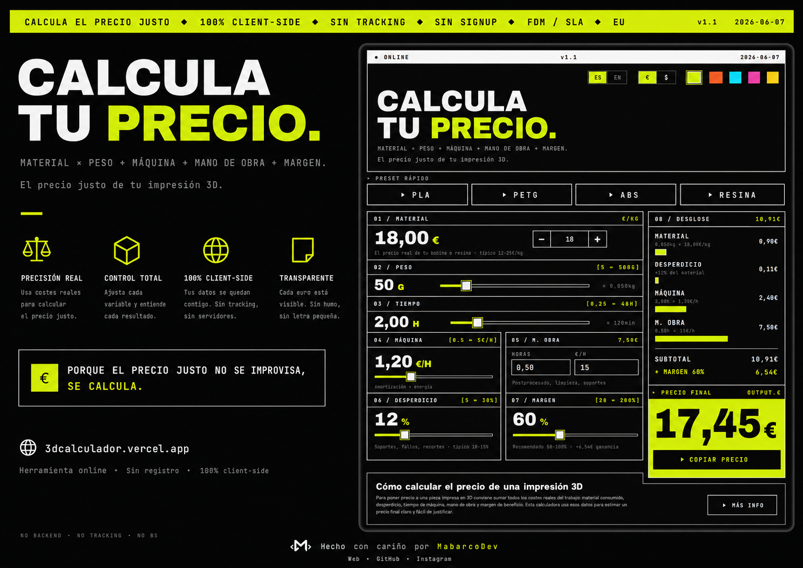

# 3D CALC

> Calcula el precio justo de tus impresiones 3D. Sin backend. Sin tracking. Sin BS.



---

## ¿Qué es?

Una calculadora web para makers y negocios de impresión 3D que necesitan poner precio a sus trabajos sin adivinar.

Introduces tus costes reales — material, máquina, mano de obra — y te devuelve el precio final con un desglose honesto. Todo ocurre en tu navegador. No hay servidor, no hay login, no hay nada que instalar.

**Fórmula:**
```
Precio = (Material + Desperdicio + Máquina + M. obra) × (1 + Margen%)
```

---

## Demo

🔗 **[3dcalcalculador](https://3dcalculador.vercel.app)**

---

## Características

- Presets rápidos para PLA, PETG, ABS y Resina
- Desglose visual de cada coste con barras proporcionales
- Precio final animado que se actualiza en tiempo real
- Selector de divisa `€ / $`
- Interfaz en español e inglés
- 5 temas de color
- 100% offline — funciona sin conexión una vez cargado

---

## Uso local

```bash
npm install
npm run dev
```

Abre [http://localhost:5173](http://localhost:5173)

---

## Deploy

El proyecto incluye `vercel.json` preconfigurado.

```bash
vercel
```

O conecta el repo directamente en [vercel.com/new](https://vercel.com/new) y cada push hace deploy automático.

---

## Stack

React 18 · TypeScript · Vite · CSS inline

Sin librerías de UI. Sin Tailwind. Sin dependencias de estilos.

---

<div align="center">

Hecho con cariño por **[MabarcoDev](https://github.com/mabarcodev)**

[](https://www.instagram.com/mabarcodev)
[](https://github.com/mabarcodev)

</div>
